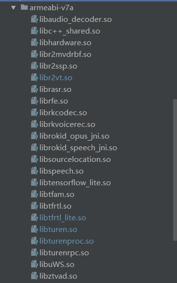
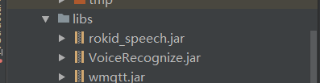
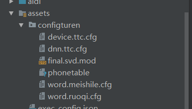
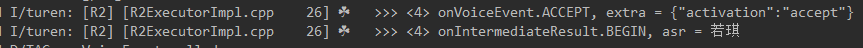

## Android 前端拾音算法集成
### [概述](introduce.md)
- 通过调用Rokid SDK接口，以Android APP方式集成前端拾音算法SDK，可为合作伙伴提供以下能力
- 获取经Rokid前端算法处理后的音频数据
- 获取经Rokid前端算法处理后的语音激活唤醒事件

### 硬件
- 可使用Rokid官方提供的开发套件,获取方式: 从[Rokid官网](https://developer.rokid.com/#/)获取 rokid all in one 全栈语音解决方案 开发套件
- 合作伙伴自研设备，目前支持硬件指标如下:
 - RAM >= 512M...
 - MIC阵列支持， 任意MIC阵列形式，单麦/线2麦/线4麦/圈4麦/圈6麦

### 软件框架
- 支持的Android OS
 - 目前SDK支持Android4.4及以上系统
- SDK下载
 - 请在 [FTP](ftp://ftp-customer.rokid-inc.com:9921/speech_sdk/v2/DNN/)下载SDK
- SDK结构
 - 一组动态链接库(算法处理，Resampling)，一组配置文件，Demo
 - [SDK目录结构](sdk_dir.md)
- 软件设计框架图 

### 集成步骤
- 下载sdk后，解压并按以下步骤配置android studio,
 - 把.so文件放入androidstudio中app\src\main\jniLibs\armeabi-v8a\下
	
 - jar架包放入app\libs\目录下
	
 - 配置文件放入\app\src\main\assets\configturen
	
 - 配置权限
	
- 参考Rokid Demo APP, 合作伙伴实现私有App获取PCM数据和唤醒事件

### 验证
- 点击运行Rokid Demo APP或自研私有设备， 对音频输入设备说唤醒词“若琪”
- adb shell 下 观察log输出，能看到如下log
	

