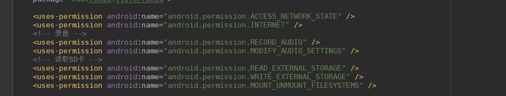

## Android 电视语音识别合成系统集成

### 概述
- Rokid 电视方案系统集成是指选择Rokid电视方案SDK下载后，通过在application或者framework上集成sdk，为各位开发者提供USB Mic语音输入，前端语音能力。
 - USB-micro语音输入
   - 语音可以通过外接USB Mic获得音频数据
 - 前端语音能力
   - 将麦克风阵列中的语音数据转换成对应的前端语音激活/休眠等事件. Rokid提供的前端语音能力可为开发者提供语音 AEC 降噪处理/回声消除处理等

### 硬件示例
- 获得硬件方式
  - 可参考Rokid官方提供，从[rokid官网](http://www.rokid.com)购买
  - 第三方购买

- 官网硬件图片如下 
	
- 支持硬件
  - 支持不同采样率的音频设备，单麦/线2麦/线4麦/圈4麦/圈6麦

### 软件框架
- 支持的Android OS
  - 支持android4.4以上版本
- SDK下载
   - 请在 [FTP](www.blank.com)上下载SDK
- SDK目录结构
  - [SDK目录结构](sdk_dir.md)
- 软件设计框架图
	

### 集成
- 下载sdk后，把shared-libraries/armeabi-v7a/*.so文件放入androidstudio中app\src\main\jniLibs\armeabi-v7a\
  - 
- java-libraries/*.jar架包放入app\libs\目录下
  - 
- configturen/* 配置文件放入\app\src\main\assets\configturen\
  - 
- 配置权限，修改AndroidManifest.xml 
  - 

### 验证
- 点击运行ROKIDDemo APP， 插入USB Mic设备，对USB Mic说唤醒词“若琪”，adb shell下观察logcat输出，能看到如下logcat输出
  - 